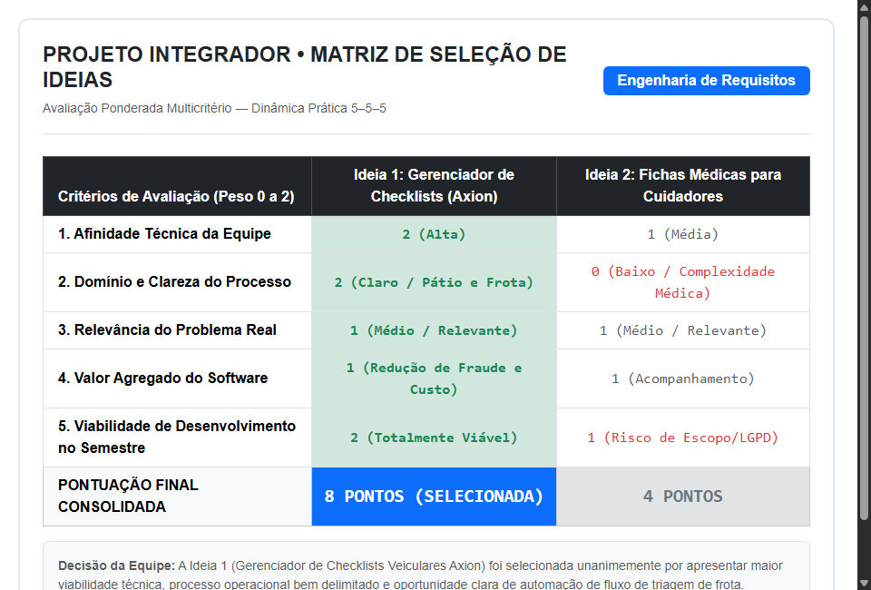
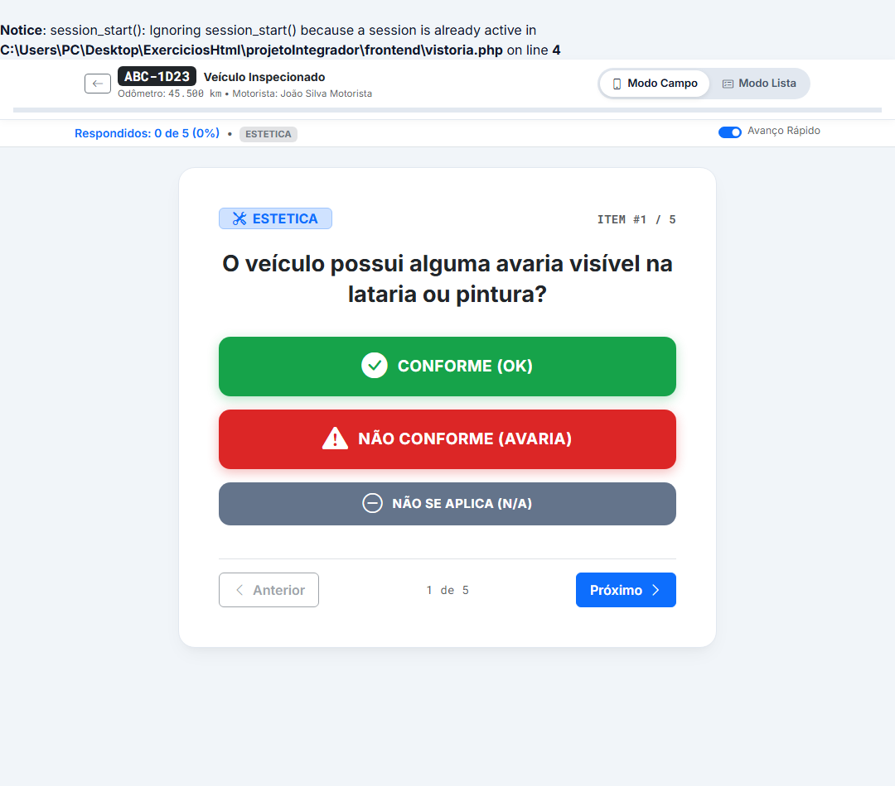
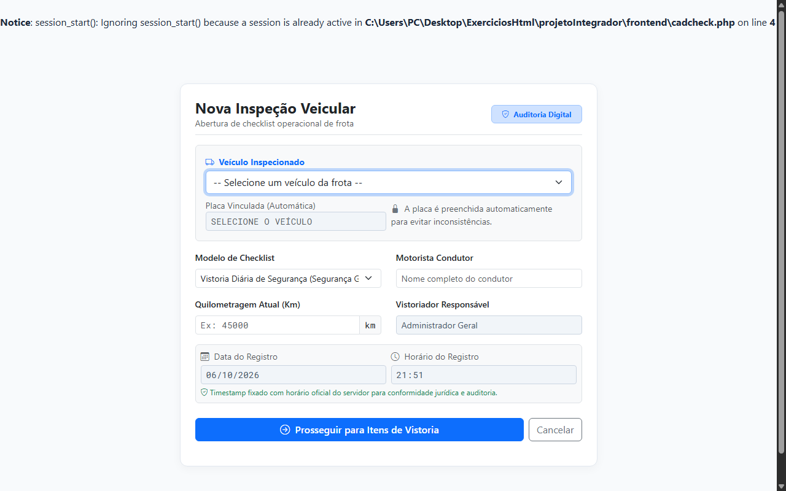
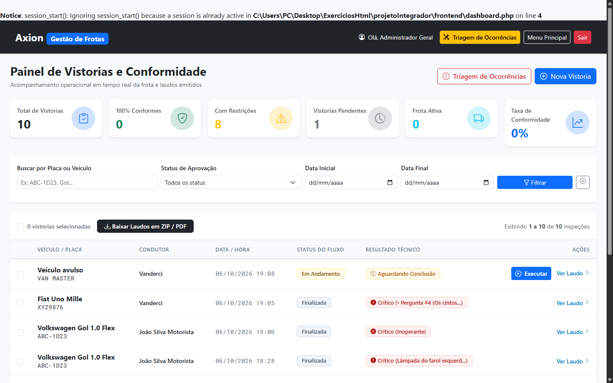
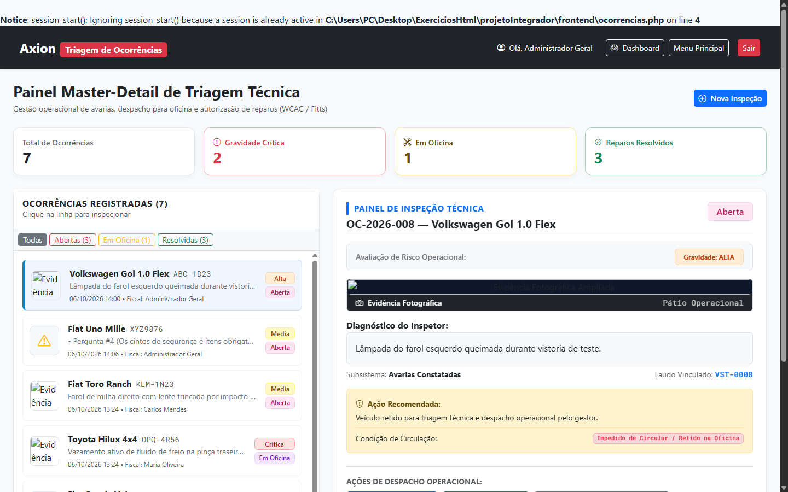
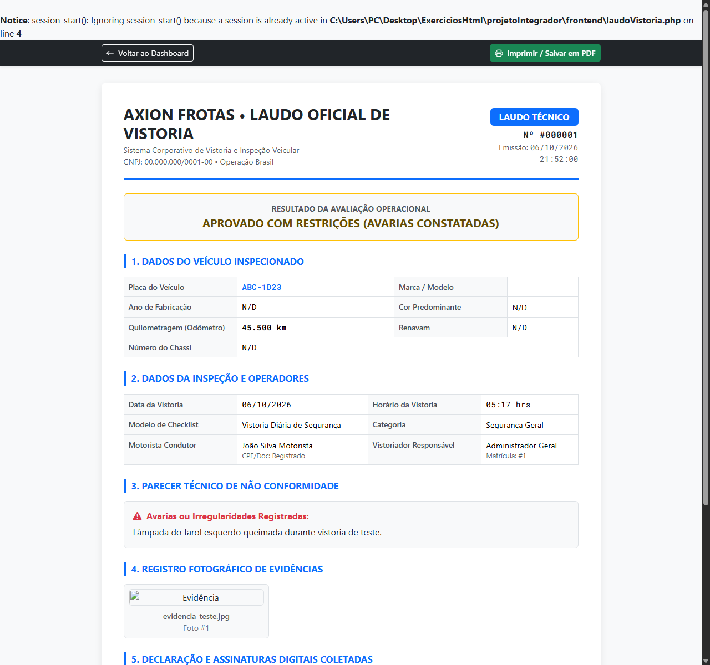
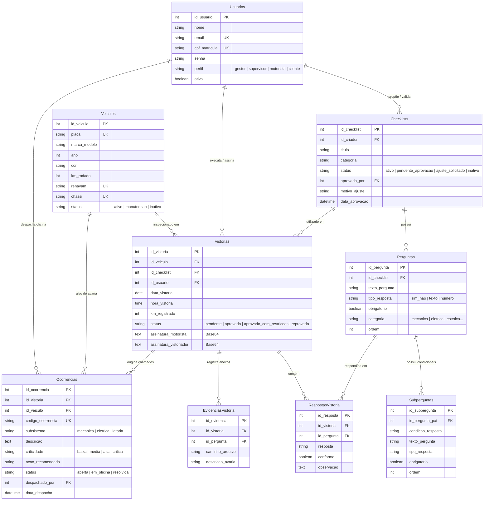
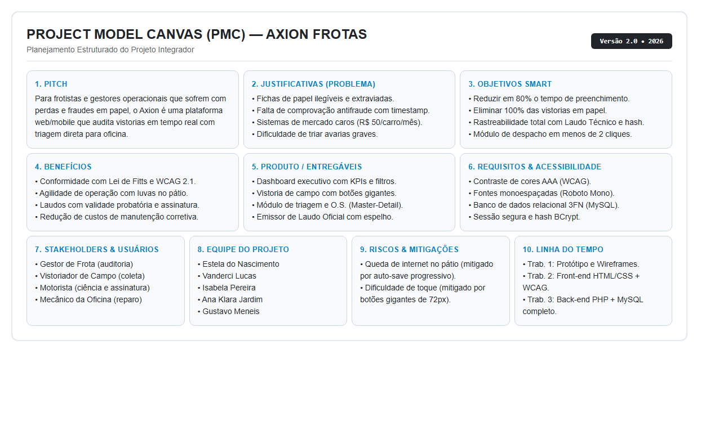

# Trabalho de PI: Gerenciador de Checklists
1. [Componentes](#1-componentes)
2. [Ideias Selecionadas, Matriz de Seleção e Opportunity Card](#2-ideias-selecionadas-matriz-de-seleção-e-opportunity-card)
   - [2.1 Ideias Selecionadas pelo Grupo](#21-ideias-selecionadas-pelo-grupo)
   - [2.2 Matriz de Seleção](#22-matriz-de-seleção)
   - [2.3 Opportunity Card da Ideia Selecionada](#23-opportunity-card-da-ideia-selecionada)
3. [Minimundo](#3-minimundo)
4. [Validação da Ideia](#4-validação-da-ideia)
5. [Personas e Histórias de Usuário](#5-personas-e-histórias-de-usuário)
6. [Protótipos do Sistema](#6-protótipos-do-sistema)
   - [6.1 Protótipo do Sistema Mobile](#61-protótipo-do-sistema-mobile)
   - [6.2 Protótipo do Sistema Web](#62-protótipo-do-sistema-web)
   - [6.3 Quais perguntas podem ser respondidas pelo sistema?](#63-quais-perguntas-podem-ser-respondidas-pelo-sistema)
7. [Modelo Conceitual](#7-modelo-conceitual)
8. [Descrição dos Dados](#8-descrição-dos-dados)
9. [Rastreabilidade dos Artefatos](#9-rastreabilidade-dos-artefatos)
10. [PMC](#10-pmc)
11. [Documentação Complementar e Entregáveis Oficiais](#11-documentação-complementar-e-entregáveis-oficiais)
---

## 1. COMPONENTES

### Integrantes do grupo

- **Ana Klara Jardim** — anaklaraifesjd@gmail.com
- **Estela do nascimento** — estela.nv2025@gmail.com
- **Gustavo Meneis** — ifesmeneis277@gmail.com
- **Isabela Pereira** — isabela.pbarreto.av@gmail.com
- **Vanderci Lucas** — in.form.magic@outlook.com

---

# 2. IDEIAS SELECIONADAS, MATRIZ DE SELEÇÃO E OPPORTUNITY CARD

## 2.1 Ideias Selecionadas pelo Grupo

Após a realização da Dinâmica Prática 5–5–5
(Problemas, soluções atuais e pessoas), foram selecionadas as
duas principais ideias consideradas pelo grupo.

### Ideia 1

**Título:** Gerenciador de checklists
**Descrição:**  
O sistema de gerenciamento de checklists é destinado a empresas que trabalham com frotas de veículos e precisam realizar inspeções periódicas para acompanhar suas condições. A proposta busca facilitar a criação, organização e execução dessas inspeções, permitindo que checklists com diferentes finalidades, como retirada e devolução de veículos, sejam gerenciados de forma mais prática e padronizada.
### Ideia 2

**Título:** Software para fichas medicas

**Descrição:**  
Nesse software todas as pessoas que tem alguma condição precisa de atenção, como, idosos, pessoas deficientes, transtorno mental que precisão de um acompanhamento especializado e os servidores da saúde e cuidadores que precisão de uma ficha para melhor direcionamento do cuidados com a pessoa.

---

## 2.2 Matriz de Seleção

### Matriz de seleção

### Resultados obtidos

#### Ideia 1 — [Título da ideia]

- Afinidade: [2]
- Processo: [2]
- Problema: [1]
- Valor do software: [1]
- Viabilidade: [2]
- **Nota final:** [8]

#### Ideia 2 — [Título da ideia]

- Afinidade: [1]
- Processo: [0]
- Problema: [2]
- Valor do software: [1]
- Viabilidade: [0]
- **Nota final:** [4]

### Ideia selecionada

**Gerenciador de Checklist**

**Justificativa:**  
Essa ideia foi selecionada por sua fácil viabilidade dentro do tempo que temos, por não envolver dados sensíveis e também porque temos um integrante do grupo que trabalha em um local que precisa de um sistema de checklist melhor.

---

## 2.3 Opportunity Card da Ideia Selecionada

### Opportunity Card

Descreva abaixo o que foi definido pelo grupo para cada item do
Opportunity Card da ideia selecionada.

### 1. Área de afinidade/contexto

Empresas que operam em turno ininterrupto de revezamento e possuem frotas de veículos que necessitam de inspeções e monitoramento periódico, como empresas de transporte e locadoras de veículos.

### 2. Problema percebido

Perda de informações coletadas em papel. Necessidade de pranchetas na área operacional, problemas com caligrafia. 

### 3. Quem possui o problema

Os usuários finais, como trabalhadores da área operacional, motoristas e vigilantes, que realizam as inspeções e registram as informações dos veículos.

### 4. Como é resolvido hoje

Formulários de checklists em papel e/ou software genérico, com limitações de espaço na tela e excesso de toques para responder uma pergunta do checklist (UX). 

### 5. Soluções semelhantes

Intelatrac 

### 6. Lacuna inicial

Software otimizado para rodar em celular, onde todas as perguntas aparecem completamente legíveis para o usuário, com opções de resposta logo abaixo da pergunta (em modo rádio). 

### 7. Pessoas acessíveis

Motoristas, vigilantes, operadores da Transpetro. 

### 8. Hipótese de oportunidade

Otimização do tempo e da qualidade das respostas dos checklists operacionais (para uma unidade como a do TABR, por exemplo, com 237 perguntas no checklist, são necessários 3 a 4 toques no celular por pergunta). 

### 9. Momento/oportunidade

Considerando que um dos integrantes do grupo é funcionário da Transpetro, pelo contrato de trabalho assinado, se a Transpetro achar interessante a solução apresentada pelo funcionário, ele não será remunerado pela aplicação desenvolvida. 

### 10. Principal incerteza/desafio

Apresentar aos órgãos decisórios dos potenciais clientes. 

---

## 3. MINIMUNDO

> O sistema é uma plataforma digital destinada à criação, gerenciamento e realização de checklists para inspeção de veículos. Os checklists são utilizados para verificar as condições dos veículos de uma frota, podendo possuir diferentes categorias e finalidades, como inspeções de retirada e devolução. Cada checklist é composto por perguntas, opções de resposta, registros de evidências e informações relacionadas à criticidade dos itens avaliados.
Os usuários podem realizar as inspeções utilizando os checklists disponíveis, registrando as respostas para cada pergunta e adicionando evidências, como fotos e observações, quando necessário. As informações registradas ficam associadas ao veículo e à inspeção realizada, permitindo acompanhar as condições encontradas e identificar possíveis problemas.
O sistema mantém o histórico das inspeções realizadas, possibilitando o acompanhamento dos resultados, das evidências e da criticidade das avaliações. Dessa forma, a plataforma auxilia no controle das condições dos veículos e no acompanhamento das informações obtidas durante as inspeções.
Essa eu acho que é a direção certa. Mantém mais ou menos o tamanho e a estrutura do mini-mundo antigo, mas agora ele realmente fala sobre o sistema de vocês, e não sobre qualquer plataforma de checklist.

### Entrevista com o usuário

[Descrever a entrevista realizada, quando aplicável.]

### Regras de negócio

1. [Regra de negócio 1]
2. [Regra de negócio 2]
3. [Regra de negócio 3]
4. [Regra de negócio 4]

---

## 4. VALIDAÇÃO DA IDEIA

### 4.1 Formulário

https://docs.google.com/forms/d/e/1FAIpQLSfhAbcdeDb946Aj8rsI9r5QmwfeYjps1cm14KZ6DWnaAxJ94Q/viewform

## 4.2 Resultados da validação

(https://docs.google.com/forms/d/1tMPbrHBxVMcUGsD_-dncfP1PgJmC2txoj9QXeERONJU/edit#responses)

### Síntese dos resultados

A pesquisa contou com 23 participantes, sendo que 18 já tiveram experiência em empresas que realizavam vistorias. Entre eles, 15 relataram que as inspeções acontecem diariamente ou várias vezes ao dia.

Os principais problemas identificados foram a dificuldade de extrair indicadores e relatórios, a demora para as informações chegarem aos gestores e a falta de comprovação visual das ocorrências. Também houve destaque para a necessidade de fotos, histórico das inspeções, integração com outros sistemas e funcionamento offline.

Além disso, 11 participantes acreditam que a digitalização dos checklists pode gerar alto impacto na produtividade ou na redução de custos. Os resultados reforçam a necessidade de uma solução que centralize as informações, facilite as inspeções e permita o acompanhamento dos resultados e evidências.

### Conclusão da validação

Os resultados da pesquisa reforçaram a proposta inicial do sistema e ajudaram a definir as principais necessidades da solução. A partir das respostas, foram priorizados recursos como registro de evidências, histórico das inspeções, relatórios e acompanhamento das informações pelo gestor.

---

## 5. S E HISTÓRIAS DE USUÁRIO

### 5.1 Personas

### Persona 1 — [Administrador]

![Persona 1] 

**Descrição:**  
Atua nos bastidores da plataforma, garantindo que as informações e estruturas utilizadas nas inspeções estejam organizadas e adequadas às necessidades da empresa.

### Persona 2 — [Usuário]

![Persona 2] 

**Descrição:**  
É o perfil que está mais próximo da atividade prática, utilizando o sistema durante a rotina de trabalho para registrar as condições encontradas de forma padronizada e documentada.

---

## 5.2 Histórias de Usuário
**História de Usuário 1 — Cadastrar usuário**

Como administrador,  
quero cadastrar usuários no sistema  
para permitir que os usuários tenham acesso às funcionalidades correspondentes ao seu perfil.

**História de Usuário 2 — Realizar login**

Como usuário,  
quero realizar login no sistema  
para acessar as funcionalidades disponíveis para o meu perfil.

**História de Usuário 3 — Definir perfil de usuário**

Como administrador,  
quero definir o perfil de cada usuário  
para controlar quais funcionalidades ele pode acessar.

**História de Usuário 4 — Criar checklist**

Como gestor,  
quero criar um checklist personalizado  
para definir as verificações que deverão ser realizadas durante uma inspeção.

**História de Usuário 5 — Configurar itens do checklist**

Como gestor,  
quero adicionar e configurar itens em um checklist  
para definir exatamente o que deverá ser verificado durante a inspeção.

**História de Usuário 6 — Editar checklist**

Como gestor,  
quero editar um checklist  
para corrigir ou atualizar suas informações e itens de verificação.

**História de Usuário 7 — Desativar checklist**

Como gestor,  
quero desativar um checklist que não está mais em uso  
para impedir que ele seja utilizado em novas inspeções sem apagar seu histórico.

**História de Usuário 8 — Visualizar checklists disponíveis**

Como funcionário ou inspetor,  
quero visualizar os checklists disponíveis  
para escolher aquele que corresponde à inspeção que preciso realizar.

**História de Usuário 9 — Iniciar inspeção**

Como funcionário ou inspetor,  
quero iniciar uma inspeção utilizando um checklist  
para registrar a vistoria que estou realizando.

**História de Usuário 10 — Responder itens do checklist**

Como funcionário ou inspetor,  
quero responder cada item do checklist  
para registrar o resultado da verificação realizada.

**História de Usuário 11 — Registrar observação**

Como funcionário ou inspetor,  
quero registrar uma observação durante uma inspeção  
para complementar as informações de uma resposta ou situação identificada.

**História de Usuário 12 — Anexar evidência**

Como funcionário ou inspetor,  
quero anexar uma evidência a uma resposta  
para comprovar visualmente ou documentalmente uma situação encontrada durante a inspeção.

**História de Usuário 13 — Salvar inspeção em andamento**

Como funcionário ou inspetor,  
quero salvar uma inspeção ainda não finalizada  
para poder continuar seu preenchimento posteriormente.

**História de Usuário 14 — Finalizar inspeção**

Como funcionário ou inspetor,  
quero finalizar uma inspeção  
para registrar oficialmente o resultado da vistoria.

**História de Usuário 15 — Registrar ocorrência**

Como funcionário ou inspetor,  
quero registrar uma ocorrência durante a inspeção  
para informar uma situação que necessita de atenção.

**História de Usuário 16 — Acompanhar ocorrências**

Como gestor,  
quero acompanhar as ocorrências identificadas nas inspeções  
para verificar quais problemas ainda precisam de atenção.

**História de Usuário 17 — Consultar histórico de inspeções**

Como gestor,  
quero consultar o histórico das inspeções realizadas  
para acompanhar os resultados das vistorias ao longo do tempo.

**História de Usuário 18 — Filtrar histórico de inspeções**

Como gestor,  
quero filtrar o histórico das inspeções  
para localizar informações específicas com mais facilidade.

---

## 6. PROTÓTIPOS DO SISTEMA

Nesta etapa foram desenvolvidos os protótipos do sistema com
o objetivo de representar a interface e identificar as
informações que deverão ser armazenadas, processadas ou
descartadas.

---

## 6.1 PROTÓTIPO DO SISTEMA MOBILE (OPERAÇÃO DE CAMPO / PÁTIO)

### Figura 1 — Execução de Vistoria no Modo Campo (Uma Pergunta por Vez com Botões Gigantes)

**Descrição e Fundamentação Ergonômica:**  
Interface projetada especificamente para uso em pátio sob sol forte e com luvas de trabalho (atendendo à **Lei de Fitts** e aos critérios de acessibilidade da Profa. Marta). Possui alvos de toque generosos de 72px de altura para operação exclusiva com o polegar (*Thumb Zone*), barra de progresso linear contínua e acionamento imediato de gaveta para captura de fotos de avarias através da câmera do celular (`capture="environment"`). Conta ainda com alternador para Modo Lista.

### Figura 2 — Abertura de Vistoria com Preenchimento Automático Antifraude

**Descrição:**  
Tela de início de inspeção onde o fiscal seleciona o veículo da frota e o sistema preenche a placa em campo de somente leitura com tipografia monoespaçada `Roboto Mono`, eliminando redundâncias visuais e digitação duplicada. A data e hora são carimbadas automaticamente pelo servidor no banco relacional para evitar preenchimento retroativo ou fraudes.

---

## 6.2 PROTÓTIPO E TELAS DO SISTEMA WEB (AUDITORIA E GESTÃO)

### Figura 3 — Dashboard Executivo e Histórico de Vistorias

**Descrição:**  
Painel gerencial consolidado com KPIs em tempo real, semiótica de cores estrita conforme **WCAG 2.1 AAA** (a cor verde esmeralda é reservada exclusivamente para vistorias 100% conformes), tipografia monoespaçada para leitura rápida de placas e quilometragens, filtros avançados e barra de ações em lote (*bulk actions*) para download consolidado de laudos técnicos.

### Figura 4 — Módulo de Triagem e Despacho de Ocorrências (Layout Master-Detail)

**Descrição:**  
Interface em layout *Master-Detail* (baseada na Figura 2 do feedback de avaliação): a coluna esquerda (*Master*) gerencia a fila de triagem com filtros operacionais (*Todas, Abertas, Em Oficina, Resolvidas*); a coluna direita (*Detail*) exibe a foto ampliada em alta resolução da avaria, diagnóstico técnico do dano, ação recomendada e os botões operacionais de despacho: **"Enviar p/ Oficina"** (que retém o veículo e abre O.S.) e **"Aprovar Reparo"** (que conclui o conserto e libera o veículo para circulação).

### Figura 5 — Laudo Oficial de Vistoria Técnica com Assinaturas Digitais

**Descrição:**  
Documento oficial com validade probatória gerado pelo sistema. Contém o parecer consolidado de aprovação ou restrição, espelho completo de cada pergunta respondida no checklist, registro fotográfico das evidências e as assinaturas digitais do motorista e vistoriador coletadas em tela sensível (*canvas*).

---

## 6.3 QUAIS PERGUNTAS PODEM SER RESPONDIDAS PELO SISTEMA?

O sistema proposto deverá fornecer informações e relatórios
relacionados às necessidades identificadas no minimundo.

### Principais relatórios

1. **[Relatório de Inspeções por Período]**  
   Apresenta a quantidade de inspeções realizadas em um período selecionado, permitindo acompanhar o volume de vistorias realizadas e ter uma visão geral da atividade de inspeção.

2. **[Relatório de Inspeções Críticas]**  
   [Reúne as inspeções que apresentaram itens classificados como críticos. O relatório permite identificar essas avaliações e consultar as informações registradas durante a inspeção.]

3. **[Relatório Comparativo de Condições dos Veículos]**  
   [Permite comparar os resultados das inspeções realizadas nos diferentes veículos, facilitando a visualização das condições encontradas e das diferenças entre os registros.]

4. **[Relatório de Histórico do Veículo]**  
   [Apresenta o histórico de inspeções de um determinado veículo, reunindo os registros realizados ao longo do tempo para acompanhar as condições identificadas em cada avaliação.]

5. **[Relatório de Inspeções por Usuário]**  
   [Apresenta as inspeções realizadas por cada usuário, permitindo acompanhar quais avaliações foram registradas por cada pessoa e consultar as informações relacionadas a essas inspeções.]

---

## 7. MODELO CONCEITUAL

O modelo conceitual foi desenvolvido considerando os requisitos,
as histórias de usuário, os protótipos e as regras de negócio
identificadas nas etapas anteriores.

## 7.1 Modelo Conceitual e Relacional

## 7.1 Modelo Conceitual e Relacional

### Notação utilizada
Diagrama de Entidade-Relacionamento (DER) normalizado na 3ª Forma Normal (3FN), implementado em MySQL (mecanismo InnoDB, charset utf8mb4) com integridade referencial e chaves estrangeiras com regras de cascata e restrição.

---

## 7.2 Principais Entidades Normalizadas

As principais entidades que compõem o núcleo operacional do sistema são:

1. **`Usuarios`** — Centraliza o controle de acesso baseado em papéis (**RBAC**): Gestor (`gestor`), Supervisor Operacional (`supervisor`), Motorista/Inspetor (`motorista`) e Cliente (`cliente`).
2. **`Veiculos`** — Cadastro da frota com dados atômicos (marca, modelo, ano, cor, placa Mercosul, km acumulado) e status de disponibilidade operacional (`ativo`, `manutencao`, `inativo`).
3. **`Checklists`** — Modelos de vistoria dinâmicos com fluxo de governança de aprovação (`ativo`, `pendente_aprovacao`, `ajuste_solicitado`, `inativo`), parecer técnico do gestor e carimbo temporal de validação.
4. **`Perguntas` e `Subperguntas`** — Itens de inspeção categorizados por subsistema técnico (mecânica, elétrica, etc.) com suporte a subcondições encadeadas e regras de obrigatoriedade.
5. **`Vistorias`** — Inspeções realizadas em campo, registrando hodômetro inicial, data/hora carimbadas pelo servidor, motorista condutor, parecer de conformidade e assinaturas digitais em canvas.
6. **`RespostasVistoria`** — Persistência atômica de cada resposta informada pelo inspetor no Modo Campo ou Modo Lista.
7. **`EvidenciasVistoria`** — Armazenamento de fotos de avarias coletadas em campo com descrição da inconformidade.
8. **`Ocorrencias`** — Fila operacional de triagem com código protocolar (OC-2026-XXX), grau de criticidade, ação recomendada e despacho para oficinas parceiras.

---

## 7.3 Principais Fluxos de Informação

### Fluxo 1 — Gestor Administrador
Possui controle irrestrito: cadastra supervisores, valida ou devolve modelos de checklist propostos pela equipe de campo, acompanha o Dashboard analítico em tempo real, despacha veículos e realiza exclusões lógicas auditadas.

### Fluxo 2 — Supervisor Operacional
Cadastra motoristas, clientes e veículos; propõe novos modelos de checklist (que passam por aprovação prévia); acompanha a fila de triagem de avarias e encaminha veículos para reparo em oficinas credenciadas.

### Fluxo 3 — Motorista / Inspetor de Campo
Executa as vistorias veiculares através do *Modo Híbrido* (Modo Campo com botões gigantes baseados na Lei de Fitts ou Modo Lista com rolagem contínua), anexa fotos de avarias, coleta assinaturas na tela sensível ao toque e emite o laudo técnico oficial.

---

## 7.4 Qualidade e Clareza

O modelo relacional foi desenvolvido buscando:
- Utilizar nomes padronizados em PascalCase e snake_case para tabelas e atributos;
- Eliminar dependências parciais e transitivas (3ª Forma Normal estrita);
- Garantir rastreabilidade total de autoria e aprovação em auditorias de frotas;
- Preservar integridade referencial com chaves estrangeiras (`FOREIGN KEY`), `ON DELETE RESTRICT` e `ON DELETE CASCADE`.

---

## 8. DESCRIÇÃO DOS DADOS (DICIONÁRIO DE DADOS)

| Tabela / Objeto | Atributo / Campo | Tipo de Dado | Restrições | Descrição Funcional |
|---|---|---|---|---|
| **Usuarios** | `id_usuario` | INT | PK, Auto Increment | Identificador único do usuário. |
| **Usuarios** | `email` | VARCHAR(150) | NOT NULL, UNIQUE | E-mail de login institucional. |
| **Usuarios** | `cpf_matricula`| VARCHAR(20) | NOT NULL, UNIQUE | CPF ou matrícula do colaborador. |
| **Usuarios** | `perfil` | ENUM | NOT NULL | Papel RBAC: `gestor`, `supervisor`, `motorista`, `cliente`. |
| **Veiculos** | `id_veiculo` | INT | PK, Auto Increment | Identificador do veículo patrimonial. |
| **Veiculos** | `placa` | VARCHAR(10) | NOT NULL, UNIQUE | Placa identificadora Mercosul/Brasil. |
| **Veiculos** | `km_rodado` | INT | NOT NULL, DEFAULT 0 | Quilometragem acumulada no hodômetro. |
| **Veiculos** | `status` | ENUM | NOT NULL | Estado: `ativo`, `manutencao`, `inativo`. |
| **Checklists** | `id_checklist` | INT | PK, Auto Increment | Identificador do modelo de checklist. |
| **Checklists** | `status` | ENUM | NOT NULL | Ciclo: `ativo`, `pendente_aprovacao`, `ajuste_solicitado`, `inativo`. |
| **Checklists** | `motivo_ajuste`| TEXT | NULL | Parecer do Gestor com orientações de correção. |
| **Checklists** | `aprovado_por` | INT | FK (Usuarios) | Gestor responsável pela validação do modelo. |
| **Perguntas** | `id_pergunta` | INT | PK, Auto Increment | Identificador da pergunta de vistoria. |
| **Perguntas** | `tipo_resposta`| ENUM | NOT NULL | Formato: `sim_nao`, `texto`, `numero`. |
| **Vistorias** | `id_vistoria` | INT | PK, Auto Increment | Identificador do registro de vistoria. |
| **Vistorias** | `status` | ENUM | NOT NULL | Resultado: `aprovado`, `aprovado_com_restricoes`, `reprovado`. |
| **Vistorias** | `assinatura_motorista` | LONGTEXT | NULL | Assinatura digital vetorizada (Base64). |
| **Ocorrencias**| `codigo_ocorrencia` | VARCHAR(20) | UNIQUE | Código de rastreabilidade (ex: `OC-2026-001`). |
| **Ocorrencias**| `criticidade` | ENUM | NOT NULL | Grau de severidade: `baixa`, `media`, `alta`, `critica`. |
| **Ocorrencias**| `status` | ENUM | NOT NULL | Fluxo de oficina: `aberta`, `em_oficina`, `resolvida`. |

---

## 9. RASTREABILIDADE DOS ARTEFATOS

A rastreabilidade estabelece o vínculo bidirecional entre as User Stories, as interfaces construídas e o esquema relacional do banco de dados.

## 9.1 História de Usuário × Protótipo

| História de Usuário | Tela da Aplicação | Objetivo / Escopo Atendido |
|---|---|---|
| **US-001** (Autenticação Segura) | `frontend/index.html` | Login com criptografia BCrypt e proteção de sessão. |
| **US-002** (Navegação Central) | `frontend/oqfazer.php` | Menu principal com renderização condicional por perfil RBAC. |
| **US-003** (Cadastro de Veículos)| `frontend/cadcar.php` | Cadastro da frota com validação de placa e chassi. |
| **US-004** (Cadastro de Usuários)| `frontend/caduser.php` | Gestão de perfis diferenciada (Gestor cadastra supervisores; Supervisor cadastra motoristas). |
| **US-005** (Criação de Checklists)| `frontend/criarChecklist.php` | Proposição dinâmica de perguntas com disciplinas técnicas. |
| **US-006** (Governança & Dupla Validação)| `frontend/gestaoChecklists.php` | Painel de homologação onde gestor valida ou solicita ajustes. |
| **US-007** (Execução Híbrida de Vistoria)| `frontend/vistoria.php` | Vistoria no Modo Campo (Fitts) e Modo Lista com registro atômico. |
| **US-008** (Triagem de Ocorrencias)| `frontend/ocorrencias.php` | Painel Master-Detail de incidentes e despacho para oficinas. |
| **US-009** (Dashboard de Frotas)| `frontend/dashboard.php` | KPIs em tempo real, taxas de conformidade e gráfico analítico. |
| **US-010** (Emissão de Laudo PDF)| `frontend/laudoVistoria.php` | Emissão de relatório oficial em UTF-8 com fotos e assinaturas digitais. |

---

## 9.2 Protótipo × Modelo Relacional

| História de Usuário | Tela | Dados Envolvidos | Entidades / Tabelas do Banco |
|---|---|---|---|
| **US-001** | `index.html` | E-mail, Hash de Senha, Perfil | `Usuarios` |
| **US-003** | `cadcar.php` | Placa, Marca, Modelo, Ano, Km | `Veiculos` |
| **US-004** | `caduser.php` | Dados Pessoais, CNH, Endereço, Papel | `Usuarios` |
| **US-005** / **US-006** | `criarChecklist.php` / `gestaoChecklists.php` | Título, Perguntas, Status, Parecer | `Checklists`, `Perguntas`, `Subperguntas` |
| **US-007** | `vistoria.php` / `cadcheck.php` | Respostas, Fotos, Assinaturas | `Vistorias`, `RespostasVistoria`, `EvidenciasVistoria` |
| **US-008** | `ocorrencias.php` | Criticidade, Subsistema, Oficina | `Ocorrencias`, `Veiculos`, `Vistorias` |
| **US-009** | `dashboard.php` | Contagem de KPIs, Histórico | `Vistorias`, `Veiculos`, `Ocorrencias` |
| **US-010** | `laudoVistoria.php` | Protocolo, Evidências, Assinaturas | `Vistorias`, `RespostasVistoria`, `EvidenciasVistoria` |

---

## 10. PMC

## 10.1 PMC desenvolvido pelo grupo

### Descrição e Planejamento Estratégico (PMC)

O **Project Model Canvas (PMC)** do projeto Axion Frotas consolida o planejamento ágil em 10 blocos fundamentais:
- **Pitch e Justificativa:** Eliminar gargalos históricos de pátio (pranchetas de papel, caligrafia ilegível e fraudes de horário) através de uma plataforma acessível que contrapõe soluções SaaS comerciais de alto custo.
- **Objetivos SMART:** Reduzir em 80% o tempo de vistoria, assegurar 100% de rastreabilidade temporal antifraude e automatizar o envio de veículos avariados para a oficina em menos de 2 cliques.
- **Produto e Acessibilidade:** Dashboard com KPIs e semiótica WCAG, Vistoria no Modo Campo com botões gigantes (Lei de Fitts), Módulo de Triagem Master-Detail e Emissão de Laudos com assinaturas digitais em canvas.
- **Equipe e Linha do Tempo:** Execução iterativa orientada pelo framework ScrumAIDev integrando Front-End, Back-End PHP e banco de dados relacional 3FN.

---

## 11. DOCUMENTAÇÃO COMPLEMENTAR E ENTREGÁVEIS OFICIAIS

Todos os artefatos de governança, evidências e entregáveis do projeto estão organizados e auditados contra links quebrados:

- 🤖 **[Relatório Oficial de Prompts de IA (`prompt.pdf`)](prompt.pdf):** Documento acadêmico compilando todos os prompts utilizados na modelagem de requisitos, banco de dados, design system e testes ponta a ponta.
- 📊 **[Guia de Apresentação e Numeração de Figuras (`docs/guia_apresentacao_slides.md`)](docs/guia_apresentacao_slides.md):** Roteiro formal para os slides com numeração de todas as figuras e justificativa mercadológica completa.
- 📁 **[Diretório de Artefatos (`arquivos/`)](arquivos/):** Reúne a Matriz de Seleção de Ideias (`arquivos/matrizSelecao.png`), o PMC (`arquivos/PMC/PMC.png`) e os protótipos de alta fidelidade.
- 📸 **[Galeria de Capturas de Tela (`docs/screenshots/`)](docs/screenshots/):** Prints oficiais das 7 principais telas funcionais do sistema em alta definição.
- 🧪 **[Guia de Execução de Testes Automatizados (`docs/guia_execucao_testes.md`)](docs/guia_execucao_testes.md):** Instruções passo a passo para execução do script de smoke test (49/49 cenários aprovados, 100% de sucesso cobrindo Autenticação, RBAC, Vistorias, PDFs e Governança de Checklists).
- 📜 **[Histórico e Histórias de Usuário (`docs/stories/`)](docs/stories/):** Especificação completa das User Stories US-001 a US-010 no padrão INVEST.

